# Career OS program graphs

Start with the [graph viewer](graphs/index.html), [tasks.md](../../tasks.md) and [PRD](../../PRD.md). These graphs show both the implementation program and the proposed runtime system; they are not evidence of deployed features.

## Program orchestration

| Graph | Purpose | Editable source | Rendered view |
| --- | --- | --- | --- |
| Release roadmap | Read the major outcomes and qualification boundaries | [Mermaid](graphs/release-roadmap.mmd) | [SVG](graphs/release-roadmap.svg) |
| Exact task dependencies | All 42 tasks and their actual prerequisites; generated from manifest | [Mermaid](graphs/task-dependencies.mmd) | [SVG](graphs/task-dependencies.svg) |
| Orchestration loop | Select → inspect → implement → verify → reconcile → record | [Mermaid](graphs/orchestration-loop.mmd) | [SVG](graphs/orchestration-loop.svg) |



The roadmap groups work for readability; it is not a substitute for the exact task DAG and does not require every task in a group to run serially. Some R2 work can start when its actual prerequisites pass. Retirement requires R2 parity and observation evidence; optional integrations and R3 intelligence do not gate removal of already-replaced UI. The full DAG deliberately has no dates because duration/capacity baselines are unknown.

## Runtime contracts

| Graph | Purpose | Editable source | Rendered view |
| --- | --- | --- | --- |
| System architecture | Existing stack and specialist workflows versus proposed composition and extensions | [Mermaid](graphs/system-architecture.mmd) | [SVG](graphs/system-architecture.svg) |
| Domain relationships | Canonical owners and associations | [Mermaid](graphs/domain-relationships.mmd) | [SVG](graphs/domain-relationships.svg) |
| Execution sequence | One real tailoring action, clarification, durable result and recovery | [Mermaid](graphs/execution-sequence.mmd) | [SVG](graphs/execution-sequence.svg) |
| Action lifecycle | Shared state transitions for Today and Coach | [Mermaid](graphs/action-lifecycle.mmd) | [SVG](graphs/action-lifecycle.svg) |



The domain graph is conceptual, not a command to create one table per box. Career extends existing account identity; Application means the existing `job_applications` owner; Document links existing CVs and new artifact types. Every relationship is same-owner scoped even where user edges are omitted for readability. Campaign assignment is optional; multiple explicit application attempts may reference one opportunity.

The execution diagram describes target behavior. PRISM exists; the general action gateway, application binding and reliable receipt/reconciliation path require implementation. Browser disconnection is not completion. Review can pause execution. Cancellation reconciliation is represented in the lifecycle and must retain any already-completed side effects.

## Keep graphs current

`python3 scripts/career_os_plan.py --write` regenerates the exact task DAG from `plan.json`. Edit the other Mermaid files when their architecture or product contracts change. Render with the helper below using Mermaid CLI on PATH and review the SVGs. The renderer records source/config/output hashes; `--check` rejects stale renders. The repository does not require the renderer as an application dependency.

```bash
python3 scripts/render_career_os_graphs.py
python3 scripts/career_os_plan.py --check
```

The static viewer loads only local SVG files and adds diagram selection, zoom and fit; no telemetry or external runtime CDN. [Rendering evidence](evidence/DIAGRAMS.md) records the actual validation performed for this planning revision.
